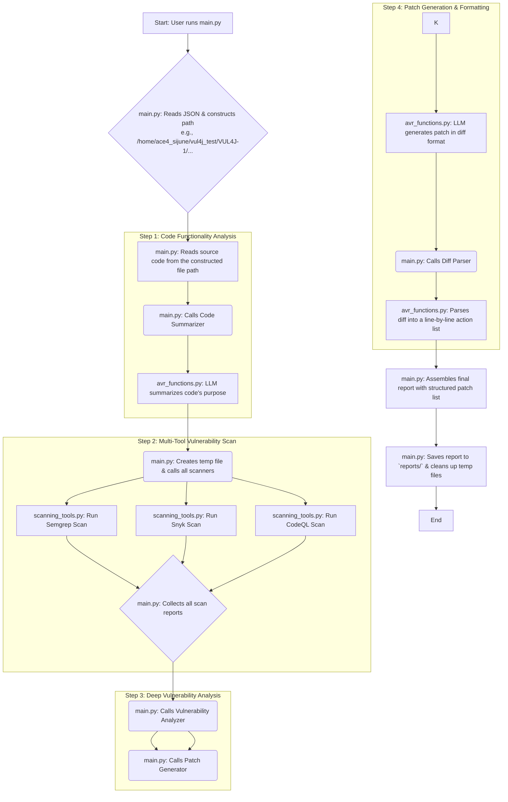

# Agent Workflow Diagram

```mermaid
graph TD
    A[Start: User runs main.py] --> B{main.py: Reads JSON & constructs path<br/>e.g., /home/ace4_sijune/vul4j_test/VUL4J-1/...};
    B --> C[main.py: Reads source code from the constructed file path];
    
    subgraph "Step 1: Code Functionality Analysis"
        C --> D(main.py: Calls Code Summarizer);
        D --> E[avr_functions.py: LLM summarizes code's purpose];
    end

    subgraph "Step 2: Multi-Tool Vulnerability Scan"
        E --> F(main.py: Creates temp file & calls all scanners);
        F --> G1[scanning_tools.py: Run Semgrep Scan];
        F --> G2[scanning_tools.py: Run Snyk Scan];
        F --> G3[scanning_tools.py: Run CodeQL Scan];
        G1 --> H{main.py: Collects all scan reports};
        G2 --> H;
        G3 --> H;
    end

    subgraph "Step 3: Deep Vulnerability Analysis"
        H --> I(main.py: Calls Vulnerability Analyzer);
        I --> J{avr_functions.py: LLM analyzes vulnerability<br/>using code summary & ALL scan reports};
    end

    subgraph "Step 4: Patch Generation & Formatting"
        I --> J(main.py: Calls Patch Generator);
        K --> L[avr_functions.py: LLM generates patch in diff format];
        L --> M(main.py: Calls Diff Parser);
        M --> N[avr_functions.py: Parses diff into a line-by-line action list];
    end

    N --> O[main.py: Assembles final report with structured patch list];
    O --> P[main.py: Saves report to `reports/` & cleans up temp files];
    P --> Q[End];
``` 